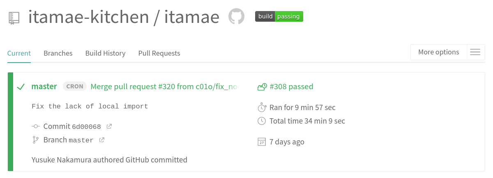
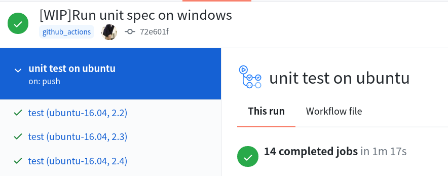
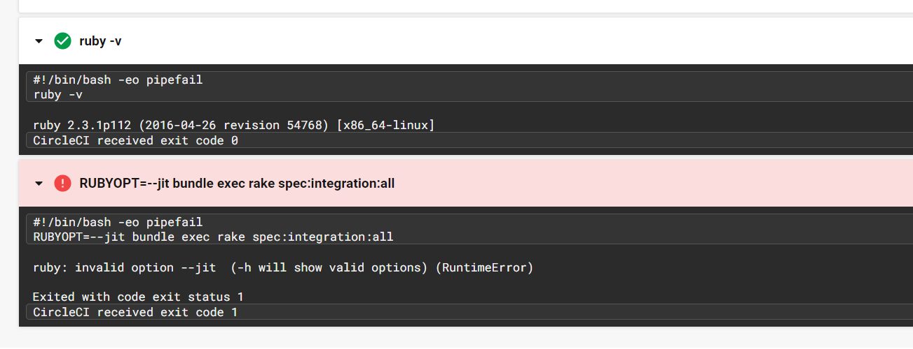
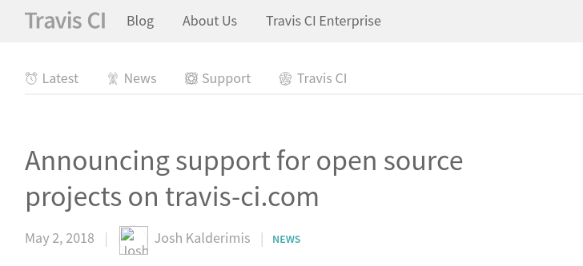
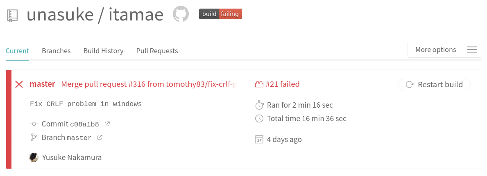

# ItamaeというIaCツールのCIについて
subtitle
: 2020-09-26

subtitle
: 第53回 情報科学若手の会

author
: うなすけ

theme
: unasuke-white

# 自己紹介
- 名前 : うなすけ
- 所属 : フリーランス
  - インフラ寄りサーバーサイドエンジニア
  - Itamae メンテナ

- GitHub [@unasuke](https://github.com/unasuke)
- Mastodon {::tag name="x-small"}[@unasuke@mstdn.unasuke.com](https://mstdn.unasuke.com/@unasuke){:/tag}
- Twitter [@yu\_suke1994](https://twitter.com/yu_suke1994)

{:relative_width="24" align="right" relative_margin_right="-9" relative_margin_top="42"}

# 宣伝
- 明日高専DJ部をやります (14:00〜) `#kosendj`
- <https://kosendj-bu.in>
- Twitchで配信するので気軽に聞きにきてください

{:relative_width="30"}

# 最初に謝罪
とてもじゃないけど5分で話せる内容ではないのでスーパー早口で話します。
内容が気になる方は今日公開予定のブログ記事も読んでいただけるとありがたいです。

# Itamaeとは？

- Itamae は構成管理ツール
  - Ruby製
  - <https://github.com/itamae-kitchen/itamae>
  - おなかま: Puppet, Chef, Ansible
- @ryotarai 氏によって作成された
- 現在のメンテナ @sue445, @ryotarai, @unasuke

{:relative_width="40" align="right" relative_margin_right="-9" relative_margin_top="44"}

# Itamaeと若手の会と僕
- 冬の陣2018
  - CIが通らない話
- 第51回
  - メンテナに直アプローチした話
- 第53回 (今回)
  - CIについて (？)

こいつItamaeの話ばっかしてんな

# ItamaeというIaCツールのCIについて
`travis-ci.org`

{:relative_width="100"}

# ItamaeのCI
たまに落ちる

{:relative_width="70"}

# ItamaeのCI
再実行ができない！！！！

# ItamaeのCI

{:.center}
{::tag name="xx-large"}しかたない、移行するぞ{:/tag}

# 前提知識: Itamaeのtestについて

- Rubyのversion
    - 2.3からheadまでの6 versions
- JITの有無
    - 2.6以上のRuby(3 versions)に対して
- unitなのかintegrationなのか
  - 実行する環境が異なる

# OSSのCIツール
public repoのCIが無料なのは、有名なのはこれら

- GitHub Actions
- CircleCI

# GitHub ActionsでItamaeのCI
まずはGitHub Actionsをやってみよう

# GitHub ActionsでItamaeのunit test

```yaml
name: "unit test on ubuntu"

on:
  push:
    branches: "*"
jobs:
  test:
    strategy:
      matrix:
        os: [ubuntu-16.04, ubuntu-18.04]
        ruby: [2.2, 2.3, 2.4, 2.5, 2.6, 2.7, head]
      fail-fast: false
    runs-on: ${{ matrix.os }}
    steps:
      - uses: actions/checkout@v2
      - uses: ruby/setup-ruby@v1
        with:
          ruby-version: ${{ matrix.ruby }}
      - run: bundle install
      - run: bundle exec rake spec:unit
```

# GitHub ActionsでItamaeのunit test
{:relative_width="100"}

通る

# GitHub ActionsでItamaeのintegration test

{:relative_height="90"}

通らない！！！！！

# integration testが通らない
{:relative_height="100"}

# integration testが通らない
{:relative_height="100"}

# integration testが通らない
- tmpディレクトリへの書き込みでコケる
- {::tag name="xx-large"}straceを有効にすると通る{:/tag}
  - なんで？？？？
- さすがに調査がしんどいので採用見送り

# CircleCIでItamaeのCI
ではCircleCIをやってみよう

# .circleci/config.yml

```yaml
version: 2.1
orbs:
  ruby: circleci/ruby@1.0.7

executors:
  docker:
    docker:
      - image: cimg/base:stable
  docker-1804:
    docker:
      - image: cimg/base:stable-18.04
  machine:
    machine:
      image: circleci/classic:201808-01

jobs:
  unit:
    parameters:
      ruby-version:
        type: string
      exec:
        type: executor
        default: ""
    executor: << parameters.exec >>
    steps:
      - checkout
      - ruby/install:
          version: << parameters.ruby-version >>
      - run: gem install bundler --version 1.17.3 --force
      - run: bundle install -j4
      - run: ruby -v
      - run: bundle exec rake spec:unit
  integration:
    parameters:
      ruby-version:
        type: string
    executor: machine
    # executor: docker
    steps:
      - checkout
      - setup_remote_docker:
          version: 18.06.0-ce
      - ruby/install:
          version: << parameters.ruby-version >>
      - run: gem install bundler --version 1.17.3 --force
      - run: bundle install -j4
      - run:
          command: |
            ruby -v
            export PATH=$HOME/.rvm/bin:$PATH
            ruby -v
      - run: bundle exec rake spec:integration:all
  unit-jit:
    parameters:
      ruby-version:
        type: string
    executor: docker
    steps:
      - checkout
      - ruby/install:
          version: << parameters.ruby-version >>
      - run: gem install bundler --version 1.17.3 --force
      - run: bundle install -j4
      - run: ruby -v
      - run: RUBYOPT=--jit bundle exec rake spec:unit
  integration-jit:
    parameters:
      ruby-version:
        type: string
    # executor: machine
    executor: docker
    steps:
      - checkout
      - setup_remote_docker:
          version: 18.06.0-ce
      - ruby/install:
          version: << parameters.ruby-version >>
      - run: gem install bundler --version 1.17.3 --force
      - run: bundle install -j4
      - run: ruby -v
      - run: RUBYOPT=--jit bundle exec rake spec:integration:all

workflows:
  version: 2
  all-test:
    jobs:
      - unit:
          exec:
            name: docker-1804
          matrix:
            parameters:
              ruby-version: ["2.3"]
      - unit:
          exec:
            name: docker
          matrix:
            parameters:
              ruby-version: ["2.4", "2.5", "2.6", "2.7"]
      - integration:
          matrix:
            parameters:
              ruby-version: ["2.3", "2.4", "2.5", "2.6", "2.7"]
  # all-test-with-jit:
  #   jobs:
      - unit-jit:
          matrix:
            parameters:
              ruby-version: ["2.6", "2.7"]
      - integration-jit:
          matrix:
            parameters:
              ruby-version: ["2.6", "2.7"]
```

読めませんが読まなくていいです

# CircleCIでItamaeのCI、壁たち
1. ruby/install-depsの挙動
2. machine executorでRubyのversionが設定できない？
3. setup_remote_dockerではvolume mountが使えない

# 1. ruby/install-depsの挙動
- CircleCI公式Orb `circleci/ruby` を使用
- `Gemfile.lock` があることを期待している
  - アプリケーション向きでライブラリ向きではない
  - 別になくてもいい (オプション指定可能)
- bundlerの重複を解決できない！

結局 `gem install bundler --force` を手書きしないといけない

# 2. machine executorでRubyのversionが設定できない？
- docker executorとmachine executorの2種類がある
  - integration testはDockerを使用するためmachine executorを使いたい
- machine executorで以下のようなエラーが出ている

{:relative_width="100"}

# 2. machine executorでRubyのversionが設定できない？
- Ruby 2.6なのに `--jit` オプションを渡せない？

{:relative_width="100"}

# 2. machine executorでRubyのversionが設定できない？
Ruby 2.6のテストでRubyのversionを出力してみると、こう

{:relative_width="90"}

Ruby 2.3になっとるやんけ！！！！！！

# 2. machine executorでRubyのversionが設定できない？
- machine executorにおいて `circleci/ruby` がうまく動かない
  - RVMのPATHが何度やっても通らない
  - そもそもそんなハックしたくない
- しかたない、setup_remote_dockerしよう

# 3. setup_remote_dockerではvolume mountが使えない
- CircleCIのdocker executor内でdockerを使用するしくみ
  - テストを実行しみると落ちる
  - どうやらvolume mountに失敗している？

> ジョブ空間からリモート Docker 内のコンテナにボリュームをマウントすること (およびその逆) はできません。
> https://circleci.com/docs/ja/2.0/building-docker-images/#section=configuration

😭😭😭😭😭😭

# 結果
CircleCIの採用も見送り……
\\n
(60回くらいCIを回している)

# what's the next ci platform?
皆さんのお好きなCIを思いうかべてみましょう

# Itamaeはtravis-ci.orgで実行されている
- `travis-ci.org` です

# travis-ci.com
{:relative_width="80"}

<https://blog.travis-ci.com/2018-05-02-open-source-projects-on-travis-ci-com-with-github-apps>

# Itamaeはtravis-ci.orgで実行されている
- `travis-ci.org` です
- `travis-ci.org` から `travis-ci.com` に移行すると、どうなる？

# Itamae CI on travis-ci.com
{:relative_width="100"}

"Restart build" できる！

# まとめ
- CI serviceにはクセがある
- travis-ciのmatrixが一番書きやすい
- 皆さんのコードのCI、 `travis-ci.com` に移行できてますか？
  - なぜオレはあんなムダな時間を……